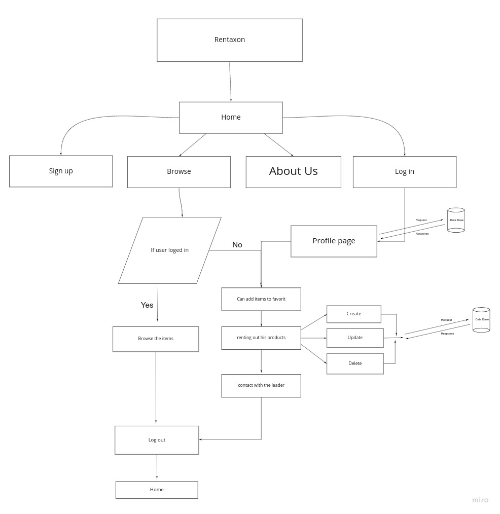
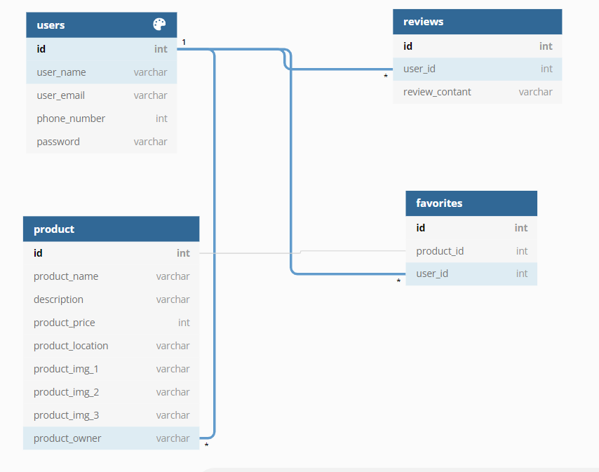

# Rentaxon

## Team members

- Moayad Osama Alhaj
- Mohammad Silwadi
- Yousef Mohammad Jariry
- Haneen Hashlamoun

## Project Idea

A rental website that can help neighbors to find clothes, equipments they need for a short period of time. Also, help people that owned these things to earn money instead of storing them in a warehouse without using them.

## Wirframes

[wireframes](https://www.figma.com/file/OQoY3ahexfNbjrXTwPXWUr/Rentaxon?node-id=0%3A1)

## PM tool

[trello](https://trello.com/b/TEUwMKJE/rentaxon)

## User Stories

1- Authentication

As a user I can create profile, can sign in so i can used the website

- given [user name ,password, user email , phone number]
- when [user asked to sign up]
- then [the user can use the website]

- given [user name ,password]
- when [user asked to sign in]
- then [the user can use the website]

As a user i can asked how the website works

- given [the user input]
- when [user asked how the website]
- then [the user can know the website works]

2- Browsing 

As a user i can search, browse a different categories

- given [Filter categories]
- when [user asked for filter categories]
- then [the user can browse the site in a simpler way]

3- Renting

As a user i can rent and view the rentals things in the website

- given [user input to rent product]
- when [the user asked to rent product]
- then [ the user can rent the product]

4- CRUD functionality

As a user i can add,update and deleate things to rent

- given [user input to add, update or delete product]
- when [the user asked for add, update or delete product]
- then [the user can add, update or delete the product]

As a user i can write review about the owner of prodect

- given[user click to write review]
- when[user ask to write review]
- then[the user can add review]

5- User's favourite

As a user i can add a product to my favourite

- given[user input to add product to favorite]
- when[user ask to add product favorite]
- then[user add product to favorite]

## Software Requirements

[requirements](requirements.md)

## Domain Modeling

## Database Schema Diagram
  

