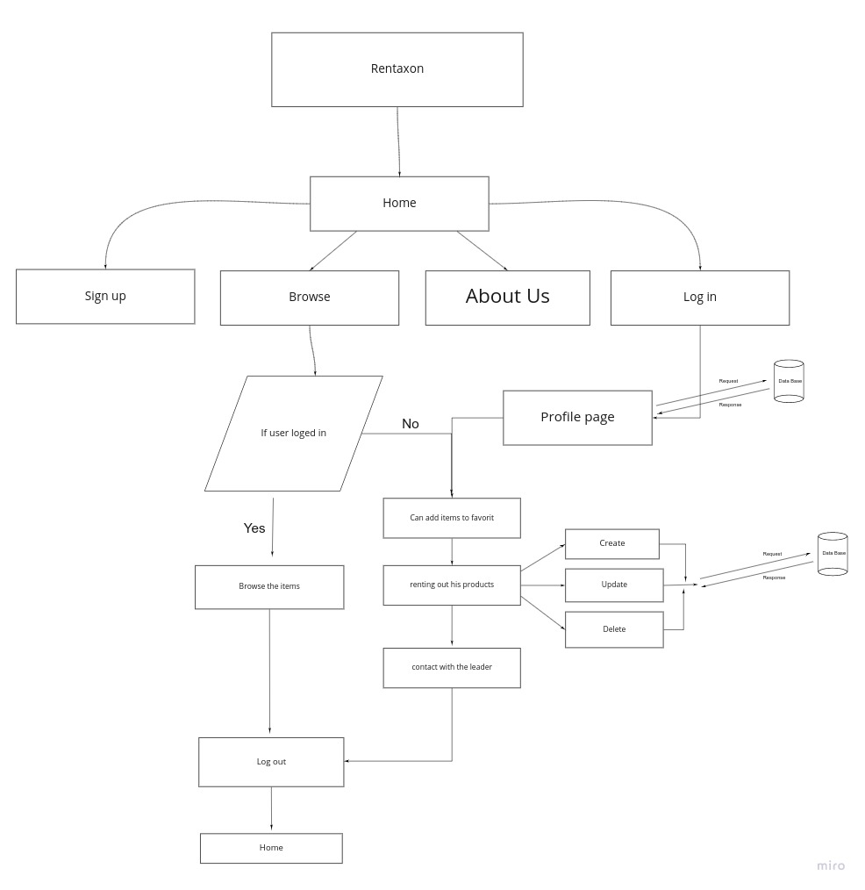

# Software Requirements

## Vision

- **What is the vision of this product?**

A rental website that can help neighbors to find clothes, equipments they need for a short period of time. Also, help people that owned these things to earn money instead of storing them in a warehouse without using them.

- **What pain point does this project solve?**

Rental saves capital, provides flexibility, and frees persons from the cost and complexity of maintaining equipment. Also, provide the ability to try these equipment or use clothes for an event or occasion.

## Scope

- IN
- **What will your product do?**

- The web app will provide information to the users about all the different products
- The web app will provide location and price to each product.
- Users will be able to "Star" their favorite products.
- Each product will contain description for the properties and renting procedure.

- Out
- **What will your product not do?**

- The wep app does not support payment.
- The wep app does not support shipping method.

## Minimum Viable Product (MVP)

**What will your MVP functionality be?**

- Create profile for users
- User can search for different categories
- User can add things to rent
- User can rent and view the rentals things in the website
- User can write review about the products

## Data Flow

## Stretch

- **What are your stretch goals?**

- Adding chat feature between the owner and user.

## Functional Requirements

- **List the functionality of your product.**

- An admin can create and delete user accounts
- A user can create, update and delete their products
- A user can search for products by its category

## Non-Functional Requirements

- Security: Implement authentication and authorization so that users can control their own data
- Testability Components should be able to be tested and modularized
